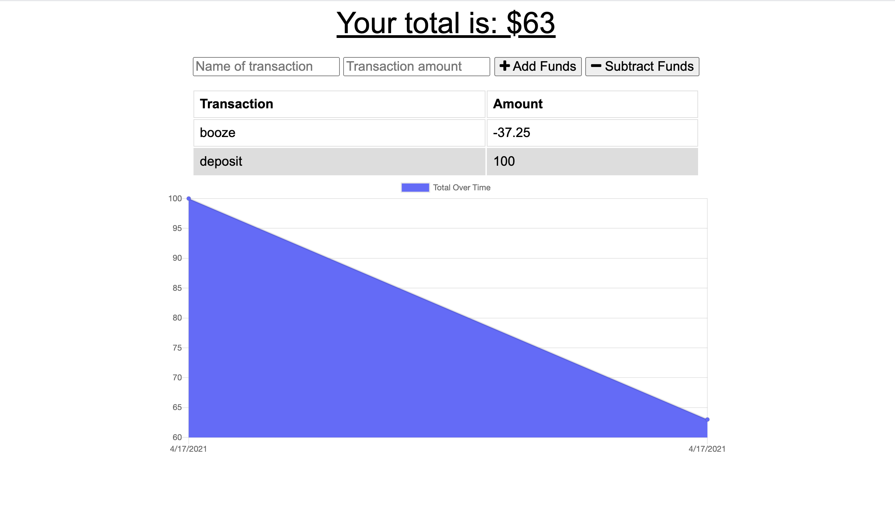
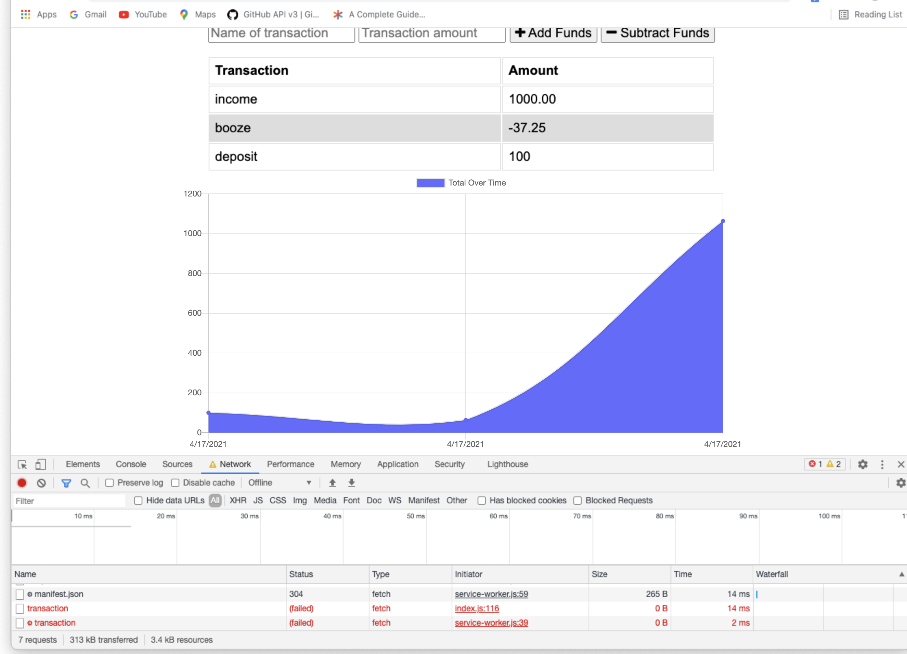

# Budget Tracker - PWA

## Description 

Giving users a fast and easy way to track their money is important, but allowing them to access that information at any time is even more important. Having offline functionality is paramount to the success of an application that handles users’ financial information. 

add functionality to an existing budget tracker application to allow for offline access and functionality. The user will be able to add expenses and deposits to their budget with or without a connection. When entering transactions offline, they should update the total when brought back online.

---

## Table of Contents 

- [Website](#website)
- [Built With](#built-with)
- [Usage](#usage)
- [Contributors](#contributors)
---

## Website

https://limitless-shelf-69548.herokuapp.com
---

## Built With
- express
- mongoose
- javascript
- indexedDB

[Back to Contents](#table-of-contents)

---

## Usage

[Back to Contents](#table-of-contents)

---

## Contributors
    
Jessica Jensen
    
GitHub: [jrjensen14](https://github.com/jrjensen14)

